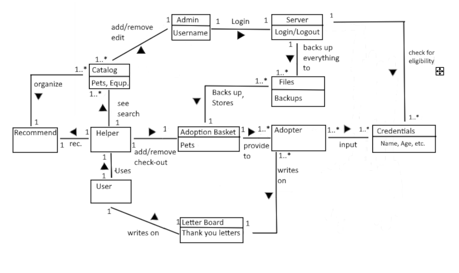
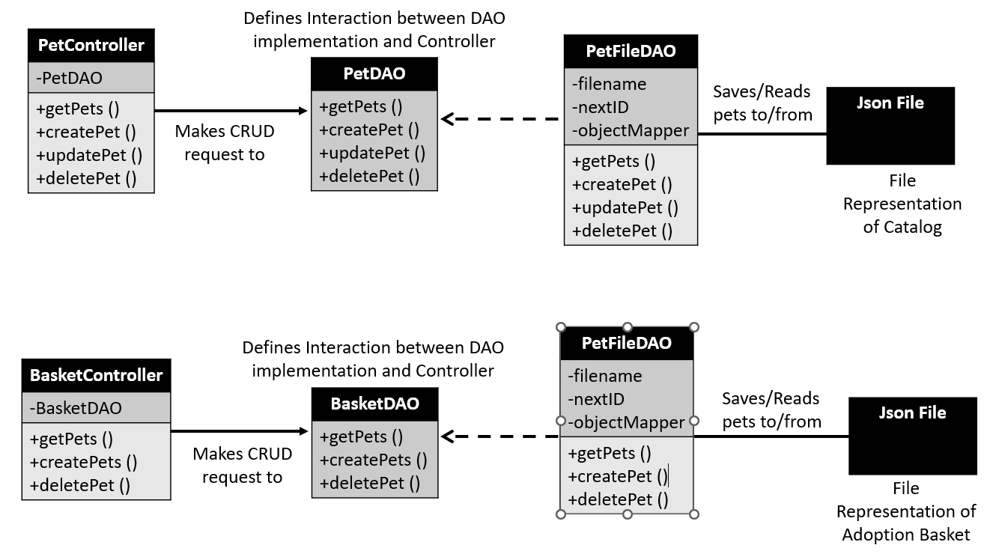
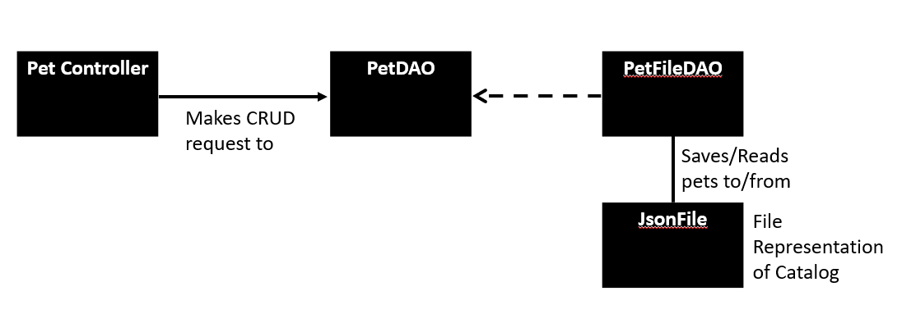
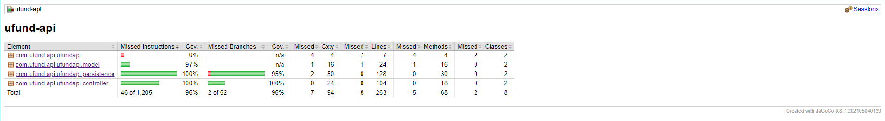

# PROJECT Design Documentation

> _The following template provides the headings for your Design
> Documentation.  As you edit each section make sure you remove these
> commentary 'blockquotes'; the lines that start with a > character
> and appear in the generated PDF in italics._

## Team Information
* Team name: The Group
* Team members
  * Frankie Jiang
  * Adam Low
  * Hunter Landolfi
  * Giacinto Fioravanti

## Executive Summary

This is a summary of the project.

### Purpose
A pet adoption website that connects Adpotion Center (UFund) Managers, with those willing and able to adopt pets (Helpers). Managers will be able to put pets up for adoption, and Helpers will be able to search through available pets, adopting the ones they want.

### Glossary and Acronyms

| Term | Definition |
|------|------------|
| SPA | Single Page |
| HLPR | Helper(s) |
| MNGR | Adoption Center Manager(s) |

## Requirements

This section describes the features of the application.

### Definition of MVP
The MVP of the Animal Adoption UFund, is a simple website that allows for MNGR to add pets to a catalog which
can be viewed by HLPR. So that HLPR can add the pets they want to an adoption basket, from which they can
proceed to adopting the pets that they liked, removing them from the catalog.

### MVP Features
>  _**[Sprint 4]** Provide a list of top-level Epics and/or Stories of the MVP._

### Enhancements
> _**[Sprint 4]** Describe what enhancements you have implemented for the project._

## Application Domain

This section describes the application domain.

The most important entities of the Domain, as far as the MVP is concerned, is the Helper, the Catalog,  the Admin, and the Adoption Basket.
- The Catalog is the main storage of pets in the server. Admin's are able add/edit one or more pets in the Catalog so that
the Helpers are able to view and search for pets within the Catalog.
- The Helper is a representation of the HLPR, they are able to move pets from the catalog into their personal adoption
basket so that they can adopt pets later on.
- The Admin is the representation of the MNGR, they are able to add/remove/edit pets in the catalog however they do not have access to any Adoption Baskets. 
- The Adoption Basket is where pets will be adopted. When a Helper moves a pet from the Catalog into the Adoption basket, it is removed from the Catalog. From here the Helper can add more pets or remove pets (with removed pets returning to the catalog), and once they are satisfied they can choose to adopt all of the pets in their catalog. In which the pets are removed from the server. (In later builds it is planned to use adopted pet information to create thank you letters).

## Architecture and Design

This section describes the application architecture.

### Summary

The following Tiers/Layers model shows a high-level view of the webapp's architecture. 
**NOTE**: detailed diagrams are required in later sections of this document. (_When requested, replace this diagram with your **own** rendition and representations of sample classes of your system_.) 

The web application, is built using the Model–View–ViewModel (MVVM) architecture pattern. 

The Model stores the application data objects including any functionality to provide persistance. 

The View is the client-side SPA built with Angular utilizing HTML, CSS and TypeScript. The ViewModel provides RESTful APIs to the client (View) as well as any logic required to manipulate the data objects from the Model.

Both the ViewModel and Model are built using Java and Spring Framework. Details of the components within these tiers are supplied below.

### Overview of User Interface

This section describes the web interface flow; this is how the user views and interacts with the web application.

> _Provide a summary of the application's user interface.  Describe, from the user's perspective, the flow of the pages in the web application._

### View Tier
> _**[Sprint 4]** Provide a summary of the View Tier UI of your architecture.
> Describe the types of components in the tier and describe their
> responsibilities.  This should be a narrative description, i.e. it has
> a flow or "story line" that the reader can follow._

> _**[Sprint 4]** You must  provide at least **2 sequence diagrams** as is relevant to a particular aspects 
> of the design that you are describing.  (**For example**, in a shopping experience application you might create a 
> sequence diagram of a customer searching for an item and adding to their cart.)
> As these can span multiple tiers, be sure to include an relevant HTTP requests from the client-side to the server-side 
> to help illustrate the end-to-end flow._

> _**[Sprint 4]** To adequately show your system, you will need to present the **class diagrams** where relevant in your design. Some additional tips:_
 >* _Class diagrams only apply to the **ViewModel** and **Model** Tier_
>* _A single class diagram of the entire system will not be effective. You may start with one, but will be need to break it down into smaller sections to account for requirements of each of the Tier static models below._
 >* _Correct labeling of relationships with proper notation for the relationship type, multiplicities, and navigation information will be important._
 >* _Include other details such as attributes and method signatures that you think are needed to support the level of detail in your discussion._

### ViewModel Tier
> _**[Sprint 4]** Provide a summary of this tier of your architecture. This
> section will follow the same instructions that are given for the View
> Tier above._

> _At appropriate places as part of this narrative provide **one** or more updated and **properly labeled**
> static models (UML class diagrams) with some details such as critical attributes and methods._
> 

### Model Tier
> _**[Sprint 2, 3 & 4]** Provide a summary of this tier of your architecture. This
> section will follow the same instructions that are given for the View
> Tier above._

> _At appropriate places as part of this narrative provide **one** or more updated and **properly labeled**
> static models (UML class diagrams) with some details such as critical attributes and methods._
> 

The model of our UFund Application can be thought of as two parallel pathways. The pathway for the Catalog and the pathway for the Adoption Basket. At the beginnning of each of these pathways is the DAO interface. This interface defines methods that are used by the specific viewmodel controller which must be implemented by our actual DAO classes. At the current state of our project, we store the data for both the Catalog and Adoption Basket in jsonFiles so we untilize specific FileDao classes to access Files for the storage of Pet Class objects as byte stream data.

## OO Design Principles
> _**[Sprint 2, 3 & 4]** Will eventually address upto **4 key OO Principles** in your final design. Follow guidance in augmenting those completed in previous Sprints as indicated to you by instructor. Be sure to include any diagrams (or clearly refer to ones elsewhere in your Tier sections above) to support your claims._

### Controller
The controller principle is utilized within our application's View-Model, Model tier interaction. We have two controllers
within our application, the PetController and the BasketController. The PetController coordinates updating and managing the
applications catalog in the model. The model is stores information via an implementation of the PetDAO interface, PetFileDAO which stores the contents of the catalog as a json file. BasketController works in the same way as PetController only it deals with updating and managing the adoption basket. 

### Single Responsibility
The Single Responsibility principle is most clearly demonstrated in the separation of controller responsibilites. While
it would be possible to give the responsibility of updating/accessing the Catalog and Adoption Basket to one controller class, to simplify the responsibilities of classes we decided that it would be best to separate these operations into two classes with their singluar responsibilities. 

> _**[Sprint 3 & 4]** OO Design Principles should span across **all tiers.**_

## Static Code Analysis/Future Design Improvements
> _**[Sprint 4]** With the results from the Static Code Analysis exercise, 
> **Identify 3-4** areas within your code that have been flagged by the Static Code 
> Analysis Tool (SonarQube) and provide your analysis and recommendations.  
> Include any relevant screenshot(s) with each area._

> _**[Sprint 4]** Discuss **future** refactoring and other design improvements your team would explore if the team had additional time._

## Testing

### Acceptance Testing
> _**[Sprint 2 & 4]** Report on the number of user stories that have passed all their
> acceptance criteria tests, the number that have some acceptance
> criteria tests failing, and the number of user stories that
> have not had any testing yet. Highlight the issues found during
> acceptance testing and if there are any concerns._

Sprint 2:
- All six newly added stories have passed all of their acceptance tests. With no noteworthy concerns arising.

### Unit Testing and Code Coverage
> _**[Sprint 4]** Discuss your unit testing strategy. Report on the code coverage
> achieved from unit testing of the code base. Discuss the team's
> coverage targets, why you selected those values, and how well your
> code coverage met your targets._

Sprint 2:

